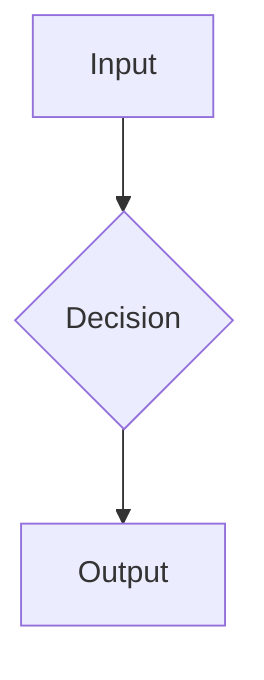

---
paths:
  - "aprendizaje/**/*.md"
---

<!-- description: Standard for study material — the Explanation layer that captures ALL project knowledge (code + domain) as didactic, atomic, verifiable concept notes -->

# Learning Style (Study Material)

`aprendizaje/` is the project's **study material**: the layer that captures *all*
the knowledge applied in the project so the user can learn and retain it — not just
software, but the domain too (petroleum engineering, geology, geophysics, data
engineering, machine learning, mathematics, statistics).

This is the **Explanation** layer (per the Diátaxis model). It answers *"why does
this work, and what is the underlying concept?"* — distinct from the other layers.

## Where this fits among the project's knowledge layers

| Layer | Question it answers | Audience | Location |
|---|---|---|---|
| **`aprendizaje/`** (this) | "What is the concept and *why* does it work?" | The user, learning | `aprendizaje/NN_<slug>.md` |
| `documentation/` | "What does this module do? Its I/O?" | Maintainers | `documentation/` |
| Bitácora | "What did I do today and why?" | The user, narrating | `todo/bitacora-*.md` |
| MEMORY.md | "What operational facts must Claude recall?" | Claude | auto memory |
| `docs/` | Public landing page | External visitors | GitHub Pages |

**Do not mix Explanation with Reference.** A study note teaches a concept from first
principles; a `documentation/` file describes the code's contract. If you are
explaining *what an Isolation Forest is and why it isolates anomalies*, that is a
study note. If you are listing *the parameters of `detect_anomalies()`*, that is
`documentation/`.

## One concept per note (atomic / Zettelkasten)

- One note = **one concept**, not one code module. Examples:
  `01_isolation_forest.md`, `02_formato_las.md`, `03_porosidad_permeabilidad.md`,
  `04_multiindex_pozos.md`, `05_variograma.md`.
- Name per `file-naming.md`: `NN_<slug>.md`. Slug uses the concept's domain term
  (English term is fine: `isolation_forest`, `kriging`, `gamma_ray_log`).
- Atomic notes are linkable and reusable across projects via Obsidian wikilinks —
  a concept learned here can be referenced from another project's vault.

## Required structure of a concept note

````markdown
# <Concept name>

> **Dominio**: <petróleo | geología | ML | data-eng | software | matemáticas | ...>
> **Prerrequisitos**: [[NN_otro_concepto]], [[NN_otro]]
> **Dificultad**: básico | intermedio | avanzado

## Intuición
Mental model first, in plain language. What is this, and what problem does it solve?
Analogy before formalism.

## Formalismo
The precise definition and the math, in LaTeX:
$$ s(x, n) = 2^{-\frac{E(h(x))}{c(n)}} $$
Explain every symbol. Motivate the formula — never drop an equation unexplained.

## Flujo / mecanismo
A Mermaid diagram when the process has steps or a pipeline:


## Contexto de dominio
The cross-domain bridge. Why does the geology/physics/business constrain this?
e.g. "Esta restricción petrofísica es la que justifica este feature de ML."

## Cómo se aplica en este proyecto
Concrete: where and how this concept is used in the codebase.
`Aplicado en: src/pipeline/detect.py:42` (always link to the real source).

## Por qué esto y no la alternativa
The decision context. What was considered and rejected, and why. (Connects to the
bitácora's "Decisiones de diseño".)

## Autoevaluación
2–3 questions. "Entiendes esto si puedes responder…". For spaced repetition.

## Referencias
Only verified-real sources (see policy below).
````

Sections that don't apply to a given concept may be omitted — but **Intuición** and
**Cómo se aplica en este proyecto** are mandatory (they make it study material tied
to real work, not an abstract encyclopedia entry).

## Didactic standards

- **Intuition before formalism.** Build the mental model, then formalize.
- **Every formula in LaTeX, every formula explained.** No unexplained symbols.
- **Mermaid for any multi-step process.** A flowchart beats a paragraph for a pipeline.
- **Cross-domain bridges are the point.** Always connect the technique to the domain
  reason it exists in *this* project (the geology/physics/business driver).
- **Anchor to real code.** Link the concept to where it lives in `src/`.
- **Concrete over abstract.** Use the project's real data/variables in examples.

## Bibliographic references — verify before citing

Hard rule. A fabricated citation is worse than no citation.

- **Only cite sources you have verified to be real.** Confirm via web search before
  writing a reference (the `/study` skill is allowed web access for this).
- Prefer **stable identifiers**: DOI, ISBN, or an official/publisher URL.
- **Never invent** authors, titles, years, DOIs, journals, or page numbers — not even
  plausible-looking ones. Do not reconstruct a citation "from memory."
- If a concept needs a source you **cannot verify**, do not fill it in. Write:
  `> [referencia por confirmar: <what to search for>]` and tell the user.
- For canonical domain textbooks (e.g., a well-known petrophysics text), a verified
  title + author + ISBN is enough; you need not have read it, but it must be real.

## Language

- **Spanish prose**, English for technical/domain terms and code (configurable).
- Same convention as the bitácora: explain in Spanish, keep `isolation forest`,
  `gamma ray`, `kriging`, `DataFrame` in English.

## Obsidian / Cowork export

Like the bitácora, each note is exported to the Obsidian vault via Cowork — with
frontmatter and wikilinks — so concepts accumulate into one cross-project knowledge
graph spanning data-eng, software, ML, petroleum, and geology. Use `[[NN_slug]]`
wikilinks between notes so the graph is navigable.

## Cross-references

- See `study/SKILL.md` for the procedure that generates and updates these notes.
- See `docs-style.md` for `documentation/` (reference docs — a different layer).
- See `memory-policy.md` for the bitácora-vs-MEMORY boundary.
- See `file-naming.md` for the `NN_<slug>.md` pattern.
